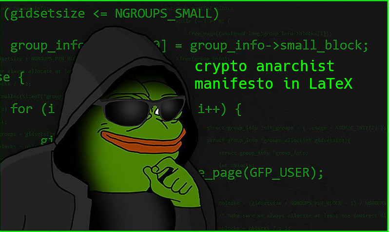

# Crypto-Anarchist-Manifesto-in-LateX
<div align="center">
  
  <br>
</div>

## Context 📖
This repository explores and discusses "The Crypto Anarchist Manifesto" written by Timothy C. May. The manifesto delves into the potential impact of computer technology on privacy, communication, and societal structures. It envisions a future where individuals can interact anonymously, free from traditional forms of government control, full text is provided as simple and clean PDF document made in LaTeX.

## Key Ideas from the Manifesto 🔐
- **Anonymous Communication:** The manifesto explores the potential for individuals to communicate and transact without revealing their true identities, using cryptographic protocols for privacy.

- **Decentralization of Power:** It anticipates a shift in the balance of power, altering the dynamics of government regulation, economic control, and the concept of trust.

- **Impact of Cryptologic Methods:** Drawing parallels with historical innovations, the manifesto suggests that cryptographic methods will fundamentally change corporations, government interference, and the nature of intellectual property.

For a more in-depth understanding, refer to the [full text of The Crypto Anarchist Manifesto](https://github.com/PsycheWiz/Crypto-Anarchist-Manifesto-in-LaTeX/blob/main/crypto_anarchist_manifesto.pdf).

## Crypto-Anarchism ⚒️
>Crypto-anarchism is a political ideology that emerges at the intersection of cryptography, technology, and political philosophy. It advocates for the use of cryptographic tools to promote individual freedoms, privacy, and autonomy in the face of increasing surveillance and centralized authority. The ideology envisions a future where individuals can communicate, transact, and express themselves freely in a decentralized and secure digital environment.
>
>At its core, crypto-anarchism draws inspiration from classical liberal and libertarian philosophies, emphasizing the importance of personal freedom, individual rights, and limited government intervention. However, it introduces a technological dimension by leveraging cryptographic techniques to achieve these goals in the digital realm.
>
>Crypto-anarchists place a strong emphasis on privacy as a fundamental human right. They argue that individuals should have the ability to communicate and interact without constant surveillance, fostering an environment where personal autonomy and individual empowerment can flourish. Cryptographic tools, such as end-to-end encryption and anonymous communication channels, are seen as essential safeguards for privacy in the digital age.

## Prerequisites
Ensure you have a LaTeX distribution installed on your system. If not, download and install a distribution such as [TeX Live](https://www.tug.org/texlive/) or [MiKTeX](https://miktex.org/).

### Download and compile  
```bash
git clone https://github.com/PsycheWiz/Crypto-Anarchist-Manifesto-in-LaTeX.git

# Navigate to the cloned repository
cd Crypto-Anarchist-Manifesto-in-LaTeX

# Compile the LaTeX document
pdflatex crypto_anarchist_manifesto.tex
